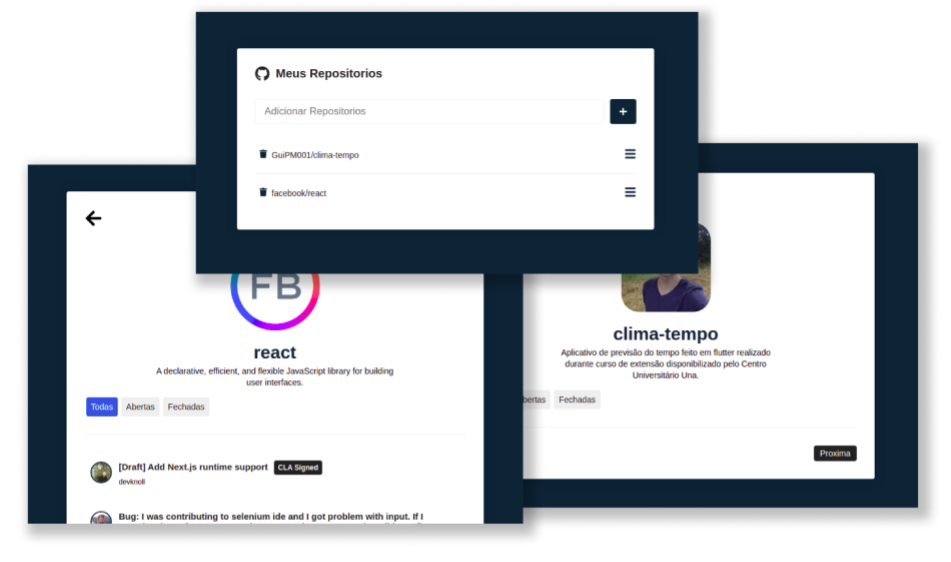

    

## ✦ Projeto

O projeto consiste em um site que te permite salvar seus repositórios favoritos, por meio da utilização da API do GitHub. O objetivo desse projeto foi implementar os principais conceitos abordados no curso "React Js do zero ao avançado na pratica" disponibilizado pela Udemy.  

